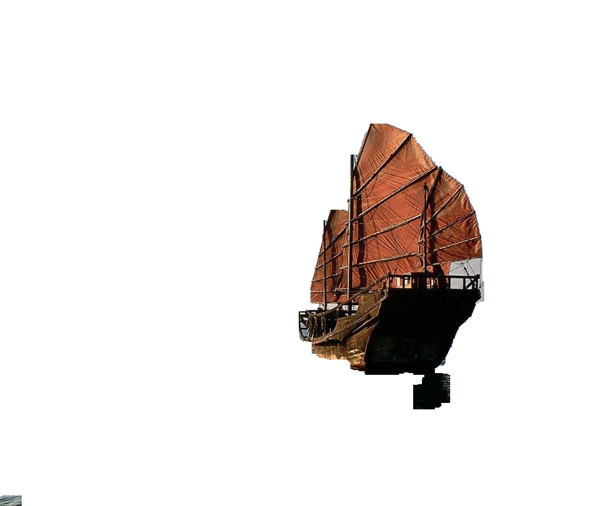

## 基于Region Grow的图像背景移除

### 运行方式

    python main.py path/to/img
    
Example

    python main.py ./img/img.png
    

运行后点击要去除区域的某个点，等待程序运行结束后结果存在程序同级目录下的result.png。

### 关于程序内的一些参数

- threshold &nbsp;&nbsp; 判断某邻域中各点是否与中心点为同一label时的阈值
- canny_low &nbsp;&nbsp; canny算子提取边缘时的下阈值
- canny_high &nbsp;&nbsp; canny算子提取边缘时的上阈值

### Region Grow的思想

以某点为中心，首先计算其邻域的点与中心点的距离(一般为欧式距离),若距离小于阈值且该点不是canny算子计算的边界，则判定该点与中心点为同一类型，即背景，将其入队列，并标记其为已访问

while(队列不空)

&nbsp;&nbsp; 取出队列中第一个点，重复上述步骤

最后去除所有标记为背景的即可。

在本实验中，计算距离不是直接在RGB空间中计算的，而是转至HLS空间，实验证明HLS空间比RGB空间更能保留整条船的信息

而计算距离就是简单的计算欧式距离。

### 实验结果

算法运行大约需要1min左右，得到结果如下：

原图

去除背景后的图

    

