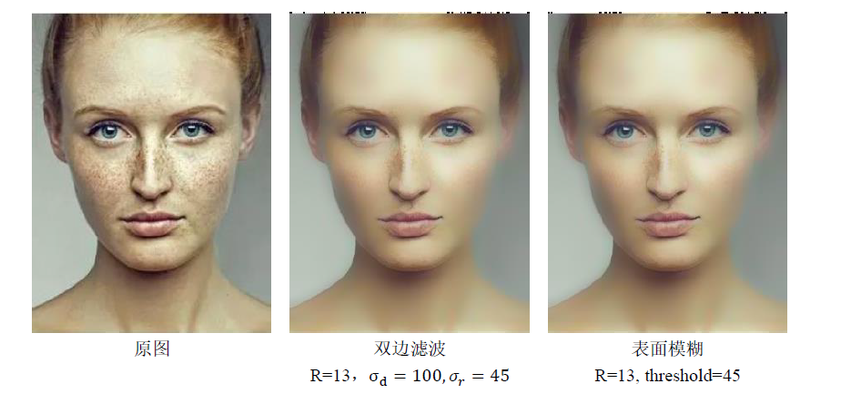
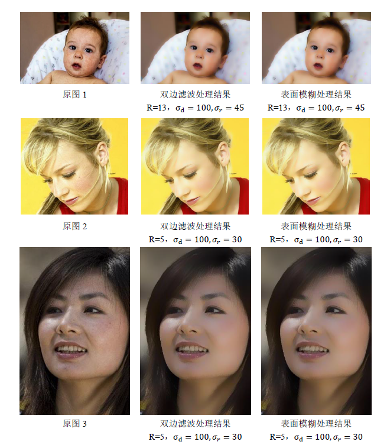

## 去除人脸雀斑

### 运行方法

    python main.py -i <img_path> [-a <algorithm>] [-r <radius>] [-t <threshold>] [-c <color_sigma>] [-s <space_sigma>]

- -i  &nbsp;&nbsp; 指明图片位置，必填项
- -a  &nbsp;&nbsp; 使用的算法，`sb`表示使用surface_blur算法，默认是`bf`，双边滤波
- -r  &nbsp;&nbsp; 邻域半径，默认是`13`
- -t  &nbsp;&nbsp; 表面模糊阈值，默认是`45`
- -c  &nbsp;&nbsp; color_sigma，默认是`45`
- -s  &nbsp;&nbsp; space_sigma，默认是`100`
- 祛斑后的图片存在源程序同级目录下

Example 
    
    python main.py -i ./img.png -a bf -r 13 -c 45 -s 100
   
or 

    python main.py -i ./img.png -a sb -r 13 -t 45

### 运行时间

针对284x381的图片，使用radius=13, color_sigma=45, space_sigma=100的参数进行滤波，双边滤波耗时大约4s。

### 效果展示

